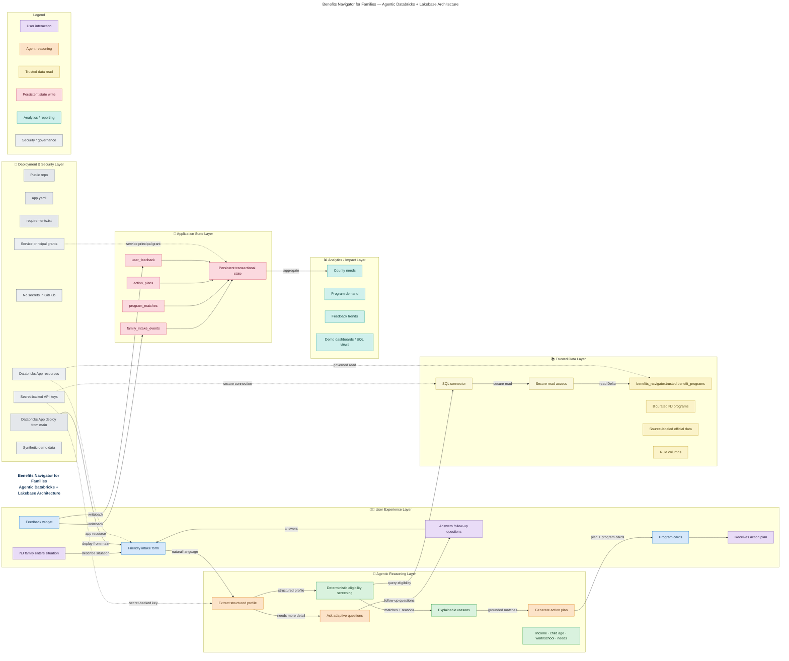

# Benefits Navigator for Families — Architecture Design

## 1. Executive Summary

**Benefits Navigator** is a Databricks-powered, agentic data application built for
social impact. It helps **New Jersey families** describe their situation in plain,
natural language — no jargon, no forms full of acronyms — and then does the hard
part for them:

1. **Understands** the family's situation using a Claude agent that extracts a
   structured profile from free text.
2. **Asks adaptive follow-up questions** only when more detail is needed to make
   an accurate match.
3. **Matches likely benefits** using **trusted Databricks data** (curated NJ
   program records in Unity Catalog) combined with an **explainable rules
   engine** — every match comes with a plain-language reason.
4. **Generates a personalized action plan** the family can act on immediately.
5. **Saves application state** (intake, matches, plan, feedback) in **Lakebase
   Postgres**, enabling a feedback loop and social-impact analytics.

The result is a warm, human experience on top of a clean, governed data
architecture: trusted reference data is separated from live transactional state,
secrets never touch source control, and every recommendation is explainable.

## 2. One-Sentence Pitch

> **Benefits Navigator turns a few sentences from a struggling family into a
> trusted, explainable, personalized plan for the benefits they qualify for —
> powered by a Claude agent, governed Databricks data, and Lakebase app state.**

## 3. Visual Architecture Diagram

The diagram below is maintained as a standalone Mermaid file:
[`docs/architecture_diagram_lucid_style.mmd`](architecture_diagram_lucid_style.mmd).

It is also embedded here so GitHub can render it inline (where Mermaid is
supported):



> If your Markdown viewer does not render Mermaid, see
> [How to render the diagram](#how-to-render-the-diagram) at the end.

## 4. Component-by-Component Explanation

### User / Family
- **What it does:** Describes their situation in their own words, answers a few
  follow-up questions, and receives a personalized action plan.
- **Why it is needed:** The whole product exists to serve families who find the
  benefits system confusing; natural language removes the biggest barrier.
- **Data read/write:** Provides free-text intake + answers; consumes program
  matches and the action plan.
- **Proves in demo:** A real person can go from "I'm a single mom with two kids
  and no health insurance" to a concrete plan in under a minute.

### Databricks App / Streamlit UI
- **What it does:** Hosts the friendly intake form, renders program cards, and
  collects feedback. Orchestrates the agent → rules → data → write-back flow.
- **Why it is needed:** Provides a warm, accessible front end and runs natively
  as a Databricks App next to the governed data.
- **Data read/write:** Reads trusted program data (via the connector); writes
  intake, matches, plan, and feedback to Lakebase.
- **Proves in demo:** A polished, deployed web app — not a notebook — running on
  Databricks infrastructure.

### Claude Agent / LLM
- **What it does:** Extracts a structured profile from free text, decides when to
  ask adaptive follow-up questions, and writes the final personalized plan.
- **Why it is needed:** Turns messy human language into structured signals the
  rules engine can screen, and turns structured results back into warm guidance.
- **Data read/write:** Reads user text + matched programs; produces a profile,
  questions, and the plan text. The API key is secret-backed (never in code).
- **Proves in demo:** Genuine agentic reasoning — understanding, asking, and
  explaining — not a scripted chatbot.

### Rules Engine
- **What it does:** Deterministic eligibility screening using income, child age,
  work/school status, and specific needs, with an explainable reason per match.
- **Why it is needed:** Eligibility must be **explainable and reproducible** —
  an LLM alone should not be the arbiter of who qualifies for benefits.
- **Data read/write:** Reads the structured profile + trusted program rule
  columns; outputs matched programs with reasons.
- **Proves in demo:** Every recommendation has a clear "why," building trust with
  judges and users alike.

### Unity Catalog / Delta — Trusted Benefits Data
- **What it does:** Stores `benefits_navigator.trusted.benefit_programs` — 8
  curated NJ programs with source-labeled official data and rule columns.
- **Why it is needed:** Recommendations must be **grounded in trusted, governed
  data**, not hallucinated by a model.
- **Data read/write:** Read-only reference data consumed by the rules engine.
- **Proves in demo:** The app's advice traces back to real, source-labeled
  program records under Databricks governance.

### Databricks SQL Warehouse / SQL Connector
- **What it does:** Provides secure, governed read access to the trusted Delta
  table via the Databricks SQL connector.
- **Why it is needed:** A managed, access-controlled path to the trusted data —
  no ad-hoc database credentials.
- **Data read/write:** Reads the trusted benefit-programs table.
- **Proves in demo:** Production-style data access with governance, with a local
  JSON fallback so the demo never breaks.

### Lakebase Postgres — Application State
- **What it does:** Stores live transactional app state in four tables:
  `family_intake_events`, `program_matches`, `action_plans`, `user_feedback`.
- **Why it is needed:** Trusted reference data is read-only; the app still needs
  a fast, transactional store for what users actually do.
- **Data read/write:** Written on every journey; read by analytics.
- **Proves in demo:** Real persistence + a feedback loop — the app remembers and
  learns from usage, with credentials managed by Databricks (no static
  passwords in production).

### Social Impact Analytics
- **What it does:** Aggregates app state into county needs, program demand, and
  feedback trends via SQL views / demo dashboards.
- **Why it is needed:** Turns individual journeys into community-level insight —
  the "social impact" story.
- **Data read/write:** Reads Lakebase app-state tables.
- **Proves in demo:** Behind every metric is a person; judges see both the
  human story and the aggregate impact.

### GitHub Repo and Deployment Flow
- **What it does:** Public repo with `app.yaml` + `requirements.txt`; the
  Databricks App deploys from `main`.
- **Why it is needed:** Reproducible, reviewable, and easy to redeploy or roll
  back.
- **Data read/write:** Source code and config only — **never** secrets.
- **Proves in demo:** A clean, professional, deployable project.

## 5. Agentic Behavior Explanation — Why This Is More Than a Chatbot

This is an **agent with tools and grounding**, not a single prompt:

1. **Natural language intake** — the family writes freely; no rigid forms.
2. **Structured profile extraction** — the agent converts text into typed
   signals (household size, income, child ages, needs, status).
3. **Adaptive follow-up questions** — the agent asks for more *only when it
   improves the match*, then merges the answers back into the profile.
4. **Tool/rules-based matching** — screening is delegated to a deterministic,
   explainable rules engine (a "tool"), not guessed by the model.
5. **Grounded trusted data** — matches are constrained by governed Unity Catalog
   records, so advice is real and source-labeled.
6. **Personalized action plan** — the agent composes a warm, concrete plan from
   the grounded matches.
7. **Persistent state and feedback loop** — every step is saved to Lakebase, and
   user ratings feed analytics that can improve the experience over time.

The agent **understands, asks, decides, grounds, explains, and remembers** —
that's agentic behavior.

## 6. Data Architecture

**Two stores, two jobs:**

| | Trusted Reference Data | Transactional App State |
|---|---|---|
| **Where** | Unity Catalog / Delta | Lakebase Postgres |
| **Table(s)** | `benefits_navigator.trusted.benefit_programs` | `family_intake_events`, `program_matches`, `action_plans`, `user_feedback` |
| **Access** | Read-only, governed, source-labeled | Read/write, transactional |
| **Change rate** | Slow, curated, reviewed | Fast, per-user, continuous |
| **Purpose** | Ground recommendations in real programs | Capture journeys + enable analytics |

**Why both are needed:** Recommendations must be **trustworthy** (governed,
source-labeled reference data), while the app must be **responsive** (a fast
transactional store for live writes). Forcing one store to do both jobs would
either slow governance or weaken trust.

**Why this separation is strong architecture:**
- **Governance where it matters** — eligibility data lives under Unity Catalog
  controls and lineage.
- **Speed where it matters** — user interactions hit a transactional Postgres.
- **Clean blast radius** — analytics and writes never touch the trusted source;
  the trusted source never depends on live app load.
- **Explainability** — matches trace to governed rows; app state traces every
  journey end-to-end via `intake_id`.

## 7. Security and Privacy Explanation

- **No secrets in GitHub** — the repo contains code and config only; no API
  keys, tokens, or passwords are committed.
- **Secrets via Databricks** — the Anthropic key and Databricks token are
  supplied as **secret-backed** environment variables / Databricks App
  resources, never hard-coded.
- **Lakebase via service principal** — in the deployed Databricks App, Lakebase
  access uses the App's **service principal** with **short-lived, rotating OAuth
  credentials** (no static database password).
- **Synthetic demo data only** — during the hackathon, all family inputs are
  **synthetic**; no real personal data is collected.
- **Production hardening (future):** real deployment would add explicit
  **consent**, **PII redaction**, a **data-retention policy**, and fine-grained
  **access controls** on the app-state tables.

Diagnostic logging is designed to be safe: it records only present/missing
status and exception types — **never** secrets, tokens, full hosts, or raw
family text.

## 8. 60-Second Judge Explanation (script)

> "Benefits Navigator helps New Jersey families find the support they qualify
> for — starting from a single sentence.
>
> A family types their situation in plain language. A **Claude agent** reads it,
> extracts a structured profile, and asks a couple of smart follow-up questions
> only if it needs to.
>
> Then a **deterministic rules engine** screens them against **trusted benefit
> programs stored in Databricks Unity Catalog** — real, source-labeled NJ data —
> so every match comes with a clear, explainable reason.
>
> The agent turns those matches into a **personalized action plan**, and we save
> the whole journey — intake, matches, plan, and feedback — into **Lakebase
> Postgres**.
>
> That gives us a **social-impact analytics layer**: county needs, program
> demand, and feedback trends.
>
> Architecturally, trusted governed data is cleanly separated from live app
> state, secrets are managed by Databricks — never in GitHub — and Lakebase uses
> the App's service principal with rotating credentials. It's agentic, it's
> grounded, it's explainable, and it's deployed as a real Databricks App."

## 9. Why This Architecture Is Hackathon-Ready

- **It runs as a real, deployed Databricks App** — not a notebook demo.
- **It's genuinely agentic** — understand, ask, ground, explain, remember.
- **It's explainable** — a deterministic rules engine gives a reason for every
  match, which matters enormously for benefits.
- **It's governed and grounded** — recommendations trace to source-labeled Unity
  Catalog data.
- **It separates concerns cleanly** — trusted reference data vs. transactional
  app state, the way a real system should.
- **It's resilient** — graceful fallbacks (local JSON if Databricks is
  unavailable; the plan still generates if Lakebase write fails), so the demo
  never hard-crashes.
- **It's secure by construction** — no secrets in source control, secret-backed
  keys, service-principal access, synthetic data only.
- **It tells a social-impact story** — individual journeys roll up into
  community-level insight.

Honest scope note: the hackathon build uses a curated set of 8 NJ programs and
synthetic inputs. The architecture is intentionally designed so that scaling the
program catalog, adding consent/redaction/retention, and expanding analytics are
**additive** — not rewrites.

## How to Render the Diagram

- **GitHub:** GitHub renders Mermaid in Markdown automatically where supported —
  the `mermaid` code block above (and the embedded diagram) should appear as a
  rendered diagram when viewing this file on GitHub.
- **Mermaid Live Editor (PNG/SVG export):** open
  <https://mermaid.live>, then paste the contents of
  [`docs/architecture_diagram_lucid_style.mmd`](architecture_diagram_lucid_style.mmd)
  and export as PNG or SVG for slides/screenshots.
- **Mermaid CLI (optional, if installed):**
  ```bash
  npx @mermaid-js/mermaid-cli -i docs/architecture_diagram_lucid_style.mmd -o docs/architecture_diagram_lucid_style.png
  ```

---

> **Note:** This diagram and document are **documentation-only** and do not
> change the working application code.
